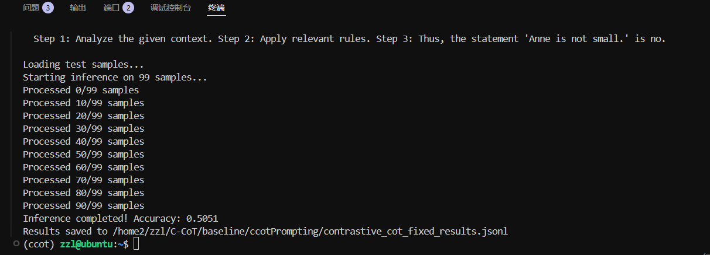
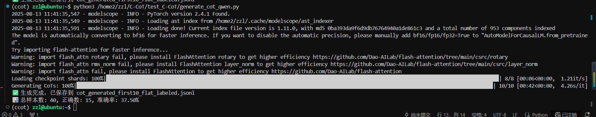

论文参考：https://arxiv.org/abs/2311.09277
"Contrastive Chain-of-Thought: Enhancing LLM Reasoning via Contrastive Representation Alignment"
（对比思维链：通过对比表征对齐增强大语言模型推理能力）

## Abstract

Chain-of-Thought (CoT) prompting enables Large Language Models (LLMs) to produce intermediate reasoning steps, improving their performance on complex reasoning tasks. However, CoT generations often contain redundant, inconsistent, or logically flawed reasoning paths, which limits their robustness and generalization. To address these issues, we propose Contrastive Chain-of-Thought (C-CoT), a novel framework that leverages contrastive representation alignment to refine and regularize LLM reasoning. In C-CoT, multiple reasoning paths are generated for each input, and contrastive learning objectives are applied to align semantically and logically consistent paths while pushing apart inconsistent or incorrect ones. Our approach incorporates both supervised and self-supervised contrastive objectives, combined with a logic-aware similarity function that integrates symbolic validation signals. This design enables the model to learn fine-grained distinctions between valid and invalid reasoning structures. Experiments on arithmetic reasoning, commonsense reasoning, and multi-hop QA benchmarks show that C-CoT achieves significant improvements in accuracy (up to +7.9% over standard CoT) and robustness under adversarial perturbations, while producing more interpretable and logically coherent reasoning traces. These results demonstrate that contrastive representation alignment offers a principled path toward more reliable, explainable, and generalizable reasoning in LLMs.

## introduction

Large Language Models (LLMs) have achieved remarkable progress in a wide range of natural language processing (NLP) tasks, including question answering, code generation, and commonsense reasoning.
Recent advances in Chain-of-Thought (CoT) prompting have further extended LLMs’ capabilities by enabling them to explicitly generate intermediate reasoning steps, thereby improving interpretability and performance on complex multi-step reasoning tasks. Despite these benefits, CoT-based reasoning still faces notable challenges: (1) reasoning paths may contain logically inconsistent or semantically irrelevant steps, (2) redundant or noisy reasoning can degrade model robustness, and (3) the lack of explicit regularization in representation space often leads to poor generalization under distribution shifts.

Contrastive learning offers a promising solution to these issues. By explicitly aligning semantically and logically consistent reasoning representations while pushing apart inconsistent ones, contrastive learning can impose a structured inductive bias that improves both the accuracy and robustness of LLM reasoning. Inspired by this, we propose Contrastive Chain-of-Thought (C-CoT), a novel framework that integrates contrastive representation alignment into the CoT generation process. C-CoT generates multiple reasoning paths for each query, encodes them into a shared representation space, and applies both supervised and self-supervised contrastive objectives to ensure that correct reasoning paths are semantically clustered and logically consistent. Furthermore, we introduce a logic-aware similarity function that incorporates symbolic validation signals to enhance alignment between reasoning steps.

We evaluate C-CoT on arithmetic reasoning, commonsense reasoning, and multi-hop QA benchmarks, demonstrating significant gains over standard CoT prompting and recent reasoning-enhancement methods, including those integrating external knowledge such as RAR. Our results indicate that contrastive representation alignment provides a principled path toward more robust, interpretable, and generalizable reasoning in LLMs.

## Related Work（部分 + 对比表格）

Chain-of-Thought Reasoning
CoT prompting has been widely explored to improve reasoning in LLMs by making intermediate steps explicit. Methods such as multi-path decoding and self-consistency [Wei et al., 2022] have shown performance improvements but still lack mechanisms to ensure semantic and logical alignment between reasoning paths.

Contrastive Learning in NLP
Contrastive learning has proven effective in representation learning for tasks like semantic similarity, information retrieval, and sentence embedding [Gao et al., 2021]. However, its application to reasoning processes—particularly aligning multi-step CoT representations—remains underexplored.

Reasoning with External Knowledge
The RAR framework [arXiv:2505.20971] aligns LLM reasoning with structured knowledge graphs to improve factual correctness in KGQA tasks. While RAR focuses on grounding reasoning in external knowledge, our work focuses on internal representation alignment for reasoning robustness and logical coherence.

Contrastive Learning for Chain-of-Thought Reasoning
Recent work has begun exploring the integration of contrastive learning into the Chain-of-Thought (CoT) paradigm to enhance reasoning robustness and accuracy.
A representative example is Contrastive Chain-of-Thought Prompting [Xie et al., 2023], which proposes to improve LLM reasoning by supplying both positive (valid) and negative (invalid) CoT examples in the prompt. By contrasting these examples during inference, the model learns to prefer logically consistent reasoning paths and reject flawed ones. The method also introduces an automatic invalid-reasoning generation module that creates diverse negative examples, reducing the reliance on manual annotation. This approach has demonstrated substantial performance gains across multiple reasoning benchmarks, such as GSM-8K and Bamboogle.

While effective, this prompting-based method operates primarily at the example level, constraining its application to few-shot or zero-shot inference settings. It does not explicitly address the representation-space alignment of reasoning paths, nor does it incorporate structured logical validation into the learning process.

In contrast, our proposed Contrastive Chain-of-Thought (C-CoT) framework generalizes the idea of contrastive reasoning beyond prompting. We generate multiple reasoning paths for each query, encode them into a shared semantic-logical representation space, and apply contrastive objectives at both the token and step levels. Furthermore, we design a logic-aware similarity function that integrates symbolic validation results, ensuring that reasoning paths are not only semantically similar but also logically sound. This representation-level alignment enables C-CoT to be applied flexibly in pretraining, fine-tuning, or task-specific adaptation, and to improve model robustness under adversarial perturbations.

| Feature                    | Contrastive CoT Prompting \[Xie et al., 2023] | **Our C-CoT**                                             |
| -------------------------- | --------------------------------------------- | --------------------------------------------------------- |
| **Core Objective**         | Contrast valid vs. invalid reasoning examples | Contrast representation embeddings of reasoning paths     |
| **Granularity**            | Example-level supervision                     | Token-level + step-level alignment                        |
| **Negative Sample Source** | Automatically generated invalid CoT examples  | Incorrect reasoning paths from multi-path decoding        |
| **Logic Integration**      | Implicit (via curated invalid examples)       | Explicit logic-aware similarity function                  |
| **Applicability**          | Few-shot / zero-shot prompting                | Pretraining, fine-tuning, task-specific adaptation        |
| **Target Benefit**         | Improve inference-time reasoning              | Improve robustness, logical coherence, and generalization |


## 实验

系统、可复现且能说服审稿人的实验方案。每一项都对应一个假设，并包含具体的数据集、基线、指标、消融设计与可视化/人判评估建议。你可以按从“必做”（核心验证）到“加分”（深入分析/扩展）的顺序来做。

---

## 实验总体目标（要证明的核心论点）

1. **C-CoT 能提升推理准确率**（比标准 CoT / Self-Consistency / Contrastive CoT prompting 更好）。
2. **C-CoT 能提高推理的鲁棒性**（对噪声、对抗路径和分布偏移更稳健）。
3. **表征层的对比对齐带来更一致、更可解释的推理链**（在表示空间上形成清晰簇，并提高逻辑一致性）。
4. **逻辑感知相似度与多粒度（token/step）损失是关键组成部分**（通过消融验证）。

---

## 1. 数据集（推荐组合，覆盖算术、常识、复杂多跳）

* **GSM-8K**（算术推理）
* **MATH (subset) 或 ASDiv/AQuA**（较难的数学题，可选）
* **StrategyQA / CommonsenseQA / CSQA**（常识推理、多跳）
* **HotpotQA / 2WikiMultiHopQA**（多跳事实推理）
* （可选）**Bamboogle / BIG-bench 推理子集** 或你关心的领域数据集

说明：选集应覆盖短链（算术）、长链（多步）、事实性（KG相关）与常识性问题，证明方法的泛化性。

---

## 2. 基线（至少包含下列）

* **Standard CoT**（单路径 CoT prompting）
* **Self-Consistency CoT**（采样多条 CoT，答案投票）
* **Contrastive CoT Prompting (Xie et al., 2023)**（示例级对比提示）
* **RAR / KG 对齐方法**（若涉及 KGQA，可作为事实性基线）
* **直接微调（no contrastive）**（如果你的方法支持 fine-tune，比对是否仅对比损失带来改进）

---

## 3. 实验设置与实现细节

* 模型：用 2 个尺度做对比（例如 GPT-style 小/中型开源 LLM，如 Llama-2-7B 与 13B 或 Qwen-7B），或若资源受限，用一个中型模型并报告泛化性。
* 生成策略：多路径生成采用温度采样或 nucleus（top-p）采样，采样数 N = {10, 20} 做灵敏度分析。
* 表征提取：对每条 CoT 提取 step-level 与 sequence-level 表征（例如用模型中某层的 token embeddings 做 pool 或用独立 encoder）。
* 对比损失：InfoNCE 为主，设计逻辑感知相似度作为额外项（参见下方“逻辑感知损失”）。
* 训练/微调：在 fine-tune 或对比微调阶段固定 LM 参数或部分微调（视资源），并与仅在 prompt 层面应用的对比方法比较。
* 重复实验：每个实验跑 3 个 seed，报告均值与标准差，并做显著性检验（t-test 或 bootstrap）。

---

## 4. 指标（自动 + 人判）

* **准确率/答对率**（primary）
* **逻辑一致性得分**：用自动逻辑检测器（例如简单 rule 或 pyDatalog 验证器）统计 CoT 是否违反已知逻辑约束（或用你的逻辑验证模块输出 True/False）。
* **鲁棒性指标**：在对抗提示 / 噪声输入下的准确率下降幅度（delta accuracy）
* **答题置信度 / 校准**（Expected Calibration Error）
* **可解释性 / 人类评估**：随机抽样若干 CoT，让人类评审“正确性”、“清晰性”、“冗余度”，打分（例如 1–5）。
* **表示空间质量**：聚类指标（Silhouette、Davies-Bouldin），以及 t-SNE/UMAP 可视化（展示正/负簇分离）。

---

## 5. 必做实验（核心验证）

1. **主性能对比**：在上述数据集上比较 C-CoT vs 基线（Standard CoT, Self-Consistency, Contrastive CoT Prompting）。报告准确率、置信区间与显著性。
   期望结果：C-CoT 在多数数据集上显著优于 Standard CoT & Self-Consistency；相对于 Contrastive CoT Prompting 有稳定提升（如果你在表征层比他们在示例层更有优势）。

2. **鲁棒性测试**：对输入/Prompt 添加噪声或注入误导性句子（例如给出矛盾背景），测量准确率下降。比较各方法的下降幅度。
   期望结果：C-CoT 的下降最小，体现鲁棒性。

3. **逻辑一致性检测**：用你设计的逻辑验证器（或 pyDatalog）统计 CoT 路径的逻辑错误率（错误路径比例）。
   期望结果：C-CoT 产生的 CoT 有更低的逻辑错误率。

4. **表示空间可视化 + 聚类评估**：对多路径生成的表示进行 t-SNE/UMAP 可视化，计算聚类质量指标，展示正类（正确链）簇紧密、负类分散的现象。
   期望结果：C-CoT 的表示更分明（高 Silhouette 分数）。

---

## 6. 消融与分析（证明模块贡献）

逐项删除或替换，并展示性能变化：

* 去掉 **逻辑感知相似度**（只用 InfoNCE）。
* 只做 **sequence-level** 对比，去掉 **step-level/token-level** 对比。
* 把 **negative samples** 换成随机负样本（而不是多路径中错误路径）。
* 只在 inference/prompt 级别做 contrastive prompting（复现 Xie et al.）而非表征微调。

期望：每个组件（逻辑损失、多粒度对比、负样本来源）对最终增益都有贡献，尤其逻辑损失提升逻辑一致性显著。

---

## 7. 对抗 / 迁移实验（加分）

* **对抗 CoT 路径注入**：人为生成或自动制造“误导性步骤”加入采样集合，检验 C-CoT 抗干扰能力。
* **跨域迁移**：在一个任务上微调 C-CoT，然后在未见任务上测试零样本性能，观察泛化。
* **与 RAR 结合实验**（若做事实性任务）：把 KG 对齐（RAR）作为外部信号加入逻辑相似度，比较单独使用 C-CoT、单独 RAR、以及两者结合的效果。

---

## 8. 人类评估（解释性与可用性）

* 随机抽 200 个样本（各方法各 50），请 3 位注释员对每个 CoT 评三个维度：正确性、连贯性、可读性（1–5）。计算 Kappa 或一致性指标。
* 报告人判与自动指标的相关性，证明自动逻辑检测器能反映人类认知。

---

## 9. 结果呈现建议（对审稿人友好）

* 表格：主任务上的平均准确率 + 标准差 + p-values。
* 图：鲁棒性（噪声级别 vs 准确率曲线）；消融条形图（每个组件去掉后的性能）；t-SNE 可视化三图（baseline vs C-CoT）。
* 框：展示若干典型 CoT 对比（good / bad case），并给出逻辑验证器的判断。
* 附录：超参表、采样策略、训练时间与硬件（便于复现）。

---

## 10. 实施细节与工程建议

* 先做小规模原型（小模型 + 小样本）验证 pipeline，再扩到完整实验集；这样可以快速调试对比损失和表示采样。
* 负样本策略：优先使用 **多路径中明显错误/冲突路径**，比随机负样本更有效。
* 逻辑验证器：开始可用规则/pyDatalog 做基础验证，之后可引入知识库或较复杂的符号检查器。
* 记录训练/推理时间与资源开销，说明方法的实用成本。

---

## 11. 可能遇到的问题与解决办法

* **负样本不够“难”**：自动生成更具迷惑性的错误路径（模仿 Xie et al. 的策略）。
* **对比训练不稳定**：试平衡对比损失权重、使用大批量或多 GPU 的负样本（memory bank / MoCo 风格）。
* **逻辑检测器错误率高**：先在小规模手工标注集上校准逻辑检测规则。

---

## 12. 实验时间线（建议）

* 周 1–2：搭建 multi-path generation + 表征提取 pipeline，复现 Standard CoT & Self-Consistency baseline。
* 周 3–4：实现 C-CoT 的 InfoNCE 对比损失与多粒度表征，做小规模验证。
* 周 5–7：扩展到全部数据集，运行主实验与鲁棒性测试（注意多次 seed）。
* 周 8：消融实验 + 人类评估样本准备与评审。
* 周 9：结果整理、图表与补充实验（如 RAR 结合）。

---
## 具体论文方法

好的，我帮你把 **C-CoT（Contrastive Chain-of-Thought）** 这个方法梳理清楚，让你自己讲起来的时候既有逻辑，又能让别人一听就懂。

---

## 1. 背景问题

普通的 **Chain-of-Thought (CoT)** 依赖于模型生成一条合理的推理链，然后给出最终答案。

* 好处：让模型显式地“想步骤”，通常能提升推理准确率。
* 问题：

  1. **多路径不一致**：如果采样多条 CoT，不同路径可能答案冲突，推理逻辑也差异很大。
  2. **缺乏内部表征约束**：模型虽然生成了“字面合理”的推理步骤，但底层表示空间可能混乱（正确和错误推理的隐向量交织在一起）。
  3. **对噪声和对抗路径不稳健**：稍微改动 prompt 或插入无关信息，模型就可能走向错误路径。

---

## 2. 核心思想

**C-CoT = Chain-of-Thought + 对比表征对齐**

你不仅在推理时生成多条推理链，还把它们的**内部语义表示**（representations）拿出来，在训练（或微调）阶段用\*\*对比学习（contrastive learning）\*\*来“拉近正确推理，推远错误推理”。

简单理解：

> “让模型的脑子里，对正确的推理链更接近，对错误的推理链保持距离”
> 这样模型在以后推理时，自然会往正确簇里靠，不容易被干扰。

---

## 3. 方法步骤

### (1) 多路径生成

给一个问题 $x$，用 LLM（带温度采样）生成 $N$ 条不同的推理链：

$$
\{c_1, c_2, ..., c_N\}
$$

每条链有中间步骤和最终答案。

---

### (2) 正负样本标注

* **正样本**：最终答案正确，且推理步骤逻辑合理（可用外部验证器、规则或人类标注）。
* **负样本**：最终答案错误，或步骤中存在逻辑矛盾。

这样得到一批 **正推理链集合** $P$ 和 **负推理链集合** $N$。

---

### (3) 表征提取

对每条推理链，从模型中提取多粒度表示：

* **Token-level**（词粒度）
* **Step-level**（每个推理步骤向量）
* **Sequence-level**（整条推理链的整体向量）

这种多粒度表示，让你既能对齐整体逻辑，又能对齐局部逻辑片段。

---

### (4) 对比损失（Representation Alignment）

核心是 **InfoNCE + 逻辑感知相似度**：

$$
\mathcal{L}_{contrast} = -\log \frac{\exp(\text{sim}(z_i, z_i^+)/\tau)}{\sum_{z^- \in N} \exp(\text{sim}(z_i, z^-)/\tau)}
$$

* $z_i$：某条推理链的表示
* $z_i^+$：与它语义/逻辑一致的正样本
* $z^-$：负样本（逻辑冲突的链）
* $\text{sim}(\cdot, \cdot)$：余弦相似度或加权相似度（逻辑相似度可以作为权重）
* $\tau$：温度系数

**逻辑感知相似度**：不仅看 embedding 的相似度，还结合逻辑验证器输出的逻辑相似分数。例如，如果两条链步骤顺序和结论高度一致，给它更高相似权重。

---

### (5) 训练 / 微调

* 在生成模型的基础上，附加一个表示提取器（或直接用中间层向量），用上述对比损失训练
* 可以全参数微调（若资源够）或只微调表示层 + LoRA adapter
* 推理时**不需要**再用对比损失，只需要用微调过的模型直接生成 CoT，效果会更稳、更准

---

### (6) 推理时的用法

推理时你还是可以：

1. 单路径生成（更快）
2. 多路径 + 策略（投票 / 验证器挑选）

由于训练时学到的**表示空间分离**，即便只生成一条链，模型也倾向于产出更符合逻辑的路径。

---

## 4. 方法的优势

1. **稳健性**：表示空间对齐，让模型抗干扰
2. **一致性**：不同路径之间更一致，减少自相矛盾
3. **可解释性**：t-SNE/UMAP 可视化时，正负链簇分明
4. **可与其他方法结合**：比如 RAR（外部知识图谱对齐）可以和 C-CoT 的逻辑损失叠加

---

## 5. 和现有方法的区别

| 方法                        | 使用多路径? | 表示对齐?   | 粒度                       | 逻辑信号?      |
| ------------------------- | ------ | ------- | ------------------------ | ---------- |
| Standard CoT              | 否      | 否       | 无                        | 否          |
| Self-Consistency          | 是      | 否       | 无                        | 否          |
| Contrastive CoT Prompting | 是      | 提示级     | 示例                       | 否          |
| **C-CoT（你的）**             | 是      | 是（表示空间） | 多粒度（token/step/sequence） | 是（逻辑感知相似度） |



## 目前标准cot的准确度


## 当前实验进度
跑了三个结果，对应阶段在特征提取  
结果存储在下图地址
.png)

其中/home2/zzl/C-CoT/repr_cache_qwen7b参数为POOL_LAST_N_LAYERS = 4
结果如下

/home2/zzl/C-CoT/repr_cache_qwen7b_8b参数为POOL_LAST_N_LAYERS = 8

/home2/zzl/C-CoT/repr_cache_qwen7b_clear
参数为POOL_LAST_N_LAYERS = 8
使用数据集为/home2/zzl/C-CoT/test_C-CoT/first10_flat_labeled_onlysaveclearly.jsonl，这个数据集是只保留了有明确思维链或是yes or no的回答


-----

## 2025.8.18记录
fulltry.py和includeacc.py
其功能为基于 BERT 的对比学习模型，用于学习 "输入文本" 与 "逻辑推理文本" 之间的关联，核心是通过对比学习让模型理解文本内容与其对应的逻辑推理之间的映射关系。


### 1. 数据处理（CoTDataset）
定义了一个数据集类，用于加载和预处理数据。数据格式为包含`input`（原始文本，如"Alan is strong."）、`reasoning`（对应的逻辑推理文本，如"+strong('Alan')"）和`label`（标签）的字典。  
该类使用BERT的tokenizer对`input`和`reasoning`进行编码，转换为模型可接受的输入格式（input_ids、attention_mask等）。


### 2. 模型结构（CoTModel）
基于BERT构建了一个编码器模型，核心功能是：  
- 加载预训练的BERT模型（如bert-base-uncased）；  
- 通过`encode`方法对文本（输入文本或推理文本）进行编码，提取`[CLS]`位置的嵌入向量（代表整个句子的语义），并通过全连接层进行维度转换。  


### 3. 损失函数（info_nce_loss）
采用对比学习中的InfoNCE损失，目的是让"输入文本的嵌入"与"其对应的推理文本的嵌入"在向量空间中更接近，同时与其他推理文本的嵌入保持距离。  
特别地，引入了`logic_mask`（逻辑掩码）：通过逻辑验证标记推理文本是否有效（1=有效，0=无效），并对有效推理的样本赋予更高的损失权重（1.5倍），无效推理赋予较低权重（0.5倍），从而引导模型更关注逻辑正确的样本。


### 4. 逻辑验证（logic_verify）
调用外部脚本`pyDatalog_processing.py`验证推理文本（`reasoning`）的逻辑一致性。若验证通过返回1，否则返回0，用于生成`logic_mask`。


### 5. 训练过程（train_one_epoch）
实现了单轮训练逻辑：  
- 对输入文本和推理文本分别编码，得到嵌入向量；  
- 对每个推理文本调用`logic_verify`生成逻辑掩码；  
- 用InfoNCE损失计算输入嵌入与推理嵌入的匹配损失，并结合逻辑掩码调整权重；  
- 反向传播更新模型参数。


### 6. 整体目的
通过对比学习训练模型，使其能够学习原始文本（`input`）与其逻辑推理（`reasoning`）之间的语义关联，且更偏好逻辑有效的推理。可能用于自然语言推理、逻辑结论生成等需要文本与逻辑关联的任务。

运行结果不是很好


# 2. 训练损失变化
Epoch 1/3, Loss=0.6675
Epoch 2/3, Loss=0.6563
Epoch 3/3, Loss=0.6444
```
- 损失函数（结合逻辑掩码的InfoNCE损失）呈**持续下降趋势**，从0.6675降至0.6444，说明：
  1. 模型在训练中确实在学习“输入文本”与“推理文本”的嵌入匹配关系（符合对比学习的训练目标）；
  2. 3个epoch的训练量较少，损失下降幅度平缓，若增加epoch数，损失可能进一步降低
验证结果暴露了当前模型的关键问题，需逐指标拆解：

| 指标                | 数值    | 含义与问题分析                                                                 |
|---------------------|---------|------------------------------------------------------------------------------|
| Baseline 准确率     | 0.5000  | “Baseline（基线）”通常指**不经过逻辑验证的原始模型预测准确率**。0.5即50%，接近随机猜测水平（如二分类任务的随机准确率），说明：<br>模型仅通过对比学习学到的“输入-推理”关联很弱，尚未形成有效预测能力（可能是数据量过少、训练epoch不足、任务难度高等原因）。 |
| 逻辑验证后准确率    | 0.0000  | 指**经过`logic_verify`筛选后，剩余逻辑有效样本的预测准确率**。0%意味着：<br>所有通过逻辑验证的推理文本，模型对其对应的输入文本预测全部错误；或更可能是“逻辑验证通过的样本数为0”（结合下一个指标可确认）。 |
| 逻辑验证通过率      | 0.0000  | 指**所有验证集中的推理文本，通过`logic_verify`（调用`pyDatalog_processing.py`）的比例**。0%说明：<br>**所有验证集的推理文本都未通过逻辑验证**，是导致“逻辑验证后准确率为0”的直接原因。 |


### 关键问题定位：为什么逻辑验证通过率为0？
结合之前代码中`logic_verify`函数的逻辑（调用外部`pyDatalog_processing.py`验证推理文本），通过率为0的可能原因有3类，按优先级排序：

#### 1. 推理文本格式与`pyDatalog_processing.py`要求不匹配
`pyDatalog_processing.py`是基于**pyDatalog语法**的逻辑验证脚本（pyDatalog是声明式逻辑编程库，需严格语法），而验证集中的推理文本可能不符合其语法规则：
- 示例：若`pyDatalog_processing.py`要求推理文本必须包含“事实断言+规则”（如`+strong(Alan), strong(X) => capable(X)`），但验证集的推理文本仅为简单字符串（如“Alan is strong”），则会被判定为逻辑无效；
- 之前训练示例中的推理文本（如`+strong('Alan')`）是pyDatalog的“事实添加语法”，若验证集的推理文本格式与训练集不一致（如未加`+`、未用括号、字符串未加引号），也会验证失败。

#### 2. `pyDatalog_processing.py`脚本本身存在问题
- 脚本路径错误：若验证时调用的脚本路径（`/home2/zzl/ChatLogic/pyDatalog_processing.py`）与实际路径不一致，或脚本被修改、删除，会导致验证逻辑失效（返回默认“无效”）；
- 脚本逻辑bug：例如脚本中判断“逻辑有效”的条件写反（将“True”判定为无效，“False”判定为有效），或未正确处理输入的推理文本（如字符编码错误、空格/特殊字符导致解析失败）。

#### 3. 验证集推理文本本身逻辑错误
若验证集的推理文本确实存在逻辑矛盾（例如输入为“Alan is strong”，推理文本为“+weak('Alan')”），则会被正常判定为逻辑无效——但这种情况通常不会导致“100%不通过”，更可能是部分样本失败，需优先排除前两类格式/脚本问题。

## 之后测试/home2/zzl/C-CoT/includeaccindataset.py

验证阶段：输出 3 个核心指标：
Baseline准确率：模型对 “输入 - 推理” 匹配的预测能力（越高越好）；
逻辑验证通过率：当前数据集cot的逻辑有效性（若为 0，需优化pyDatalog_processing.py或cot格式）；
推理过程本身正确率：数据集标注的is_correct比例（反映数据集质量）。