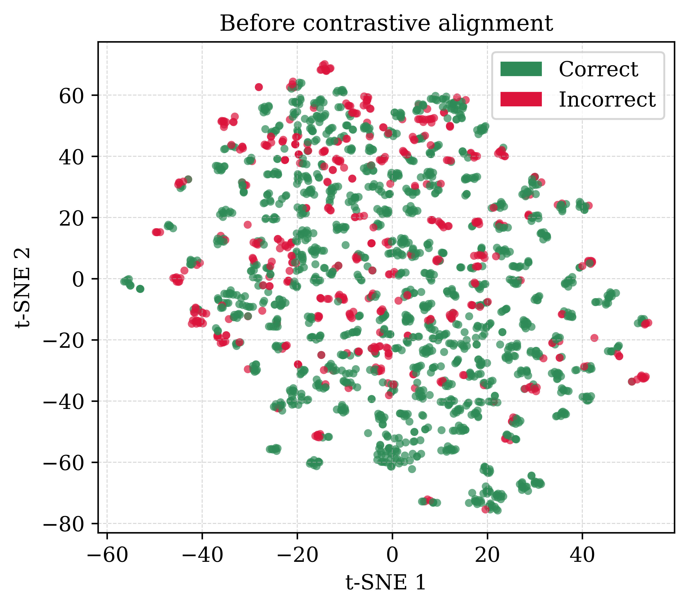
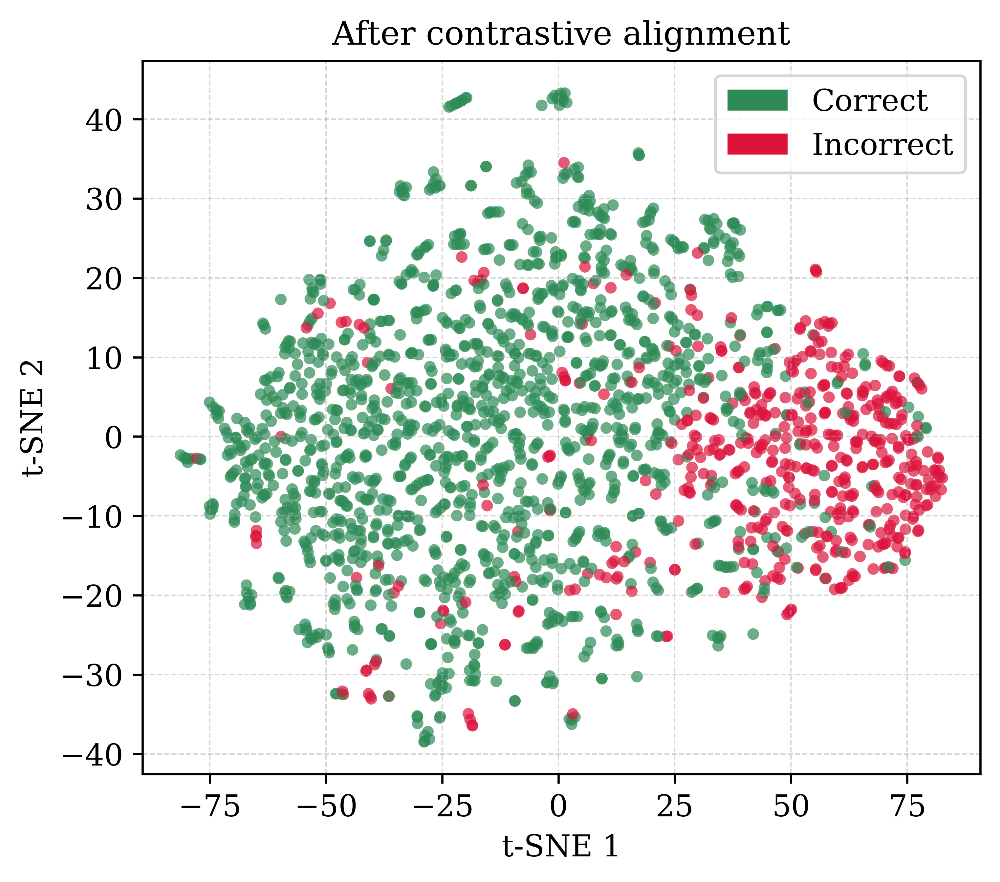

# 审稿人 #1 回复进度

---

## 审稿意见概述

D-ProtoCoT 的动机明确（PRM 需要昂贵的人工标注），但有以下担忧：

---

## 问题 1：步级标签噪声
- **问题**：监督仅来自最终答案匹配，路径级标签被广播到每一个步骤。包含有缺陷步骤但碰巧得出正确答案的路径会被视为正样本。这是 ORM 的典型失败模式，但本文却声称对局部逻辑错误具有敏感性。
- **状态**：**已完成**（草稿就绪，待进 tex）；本质只能文本软化，不能靠实验完全消除
- **分析**：这条批评本质正确——我们的监督是 outcome-level（最终答案匹配），"碰巧答对但中间步骤有误"的路径确实会被当成正样本，存在标签噪声。这与 Reviewer #6/#8 是同一问题。不能靠实验完全消除，只能：
  1. **软化过强表述**：删掉/弱化"对局部逻辑错误敏感 (sensitivity to localized logical errors)"这类断言，改成"倾向于选择与问题语义对齐、整体连贯的路径"。
  2. **正面论证为何仍然有效**：InfoNCE 是 step-level 训练，把一条正样本路径的所有 step 拉近问题、负样本的 step 推远。即使个别 step 有噪声，聚合到 path/prototype 层面时噪声被平均稀释；而系统性错误的路径其多数 step 都会偏离，仍会被区分。
  3. **用数据佐证**：`analyze_reviewer1_q3.py` 的 **M4 AUC**（alignment 预测路径正确性）> 0.5 就说明，即便存在标签噪声，学到的表示仍能有效区分对/错路径——噪声没有摧毁信号。
- **计划**：论文正文改 claim（措辞软化）+ 引用 M4 AUC 作为"噪声下仍有效"的证据。无需新实验。

---

## Q1 定稿草稿（软化"检测局部逻辑错误" + 坦诚标签噪声 + M4 兜底）

### 正文强断言出现的四处（tex 行号，均需软化）
| tex 行 | 位置 | 原文关键短语 | 改为 |
|-------|------|-------------|------|
| 258 | Method | sensitive to localized logical errors that would otherwise be averaged out | attuned to how well each step aligns semantically with the question, a signal that is diluted under path-level averaging |
| 280 | Method | sensitivity to localized errors | sensitivity to step-level semantic consistency |
| 459 | Analysis | sensitive to localized logical errors | sensitive to step-level semantic consistency with the question |
| 499 | Experiments | making the encoder sensitive to localized logical errors | shaping a representation in which step-level semantic consistency, not just final-answer correctness, drives alignment |

**核心策略**：不再声称"检测局部逻辑错误"（审稿人正确指出我们监督是 outcome-level，无此能力）；改称"捕捉步-问语义一致性 + 训练几何不同（稠密监督）"，并用 M4=0.78 证明噪声未摧毁信号。

---

### 版本 A：Rebuttal 段落（英文，回信用）

> **Reply to Reviewer #1, Concern #1.**
>
> The reviewer is correct, and we thank them for the precise diagnosis. Our supervision is indeed outcome-derived: path-level labels come from final-answer matching and are broadcast to every step, so a path that reaches the correct answer through a flawed step is nominally labeled positive — the same label-noise mode as ORM. We have accordingly **softened our claims throughout the paper**: we no longer state that the encoder is "sensitive to localized logical errors," and instead describe it as attuned to *step-level semantic consistency with the question* (Method Sec. and Analysis Sec.).
>
> We do, however, want to clarify why the method remains effective despite this shared label noise, as this is not a matter of cleaner labels but of a different *training geometry*. Step-level InfoNCE aligns each of the $|\mathcal{P}|\cdot M$ steps of a correct path to the question independently, rather than aligning one path-level vector. Occasional step-level label noise (a flawed step inside a nominally-positive path) is therefore a minority signal that is diluted twice: once when many steps of the same path are averaged into a path embedding, and again when path embeddings are aggregated into the dynamic prototype. Systematically flawed paths, by contrast, have most of their steps deviating and remain separable.
>
> This is not merely argued: on 200 GSM8K questions, the learned alignment predicts path correctness with an **AUC of 0.78**, showing that the outcome-level label noise does not overwhelm the learned signal. We have added this evidence to the paper.

---

### 版本 B：正文改动（tex 落地）

**(1) 四处软化**：按上表逐行替换。

**(2) 在 Experiments 批 ORM 处（line 499–500 之间）补一段"坦诚 + 反驳"**：

> \emph{We note that D-ProtoCoT's supervision, like ORM's, is derived from final-answer matching, so individual step labels are inherited from the path outcome, and a path that reaches the correct answer through a flawed step is nominally labeled positive. The advantage is therefore not cleaner step labels but a different training geometry: step-level InfoNCE provides $|\mathcal{P}|\cdot M$ positive pairs and aligns every step to the question independently, so occasional step-level label noise is a minority signal that is averaged out when path embeddings are aggregated into the prototype. Empirically, the resulting alignment still predicts path correctness with an AUC of $0.78$ on GSM8K, indicating that the label noise does not overwhelm the learned signal.}

**注意事项**：
- 两版都**主动承认**监督是 outcome-level、和 ORM 同源标签噪声（接住审稿人的话）。
- 不再声称"检测局部错误"，只声称"步-问语义一致性 + 稠密监督几何"。
- 用 **M4=0.78（仅 GSM8K）** 兜底，未碰 StrategyQA。
- 与 Q3 共用同一份 JSON 证据，口径一致。

---

## 问题 2：对齐 ≈ 推理质量 仅被断言
- **问题**：建议在图 2 中添加训练后的对比可视化图，并补充定量指标（如相似度预测路径正确性的 AUC）
- **状态**：**已完成**（图 + AUC 都已跑出）
- **审稿人要两样东西，均已交付**：
  - **(a) 定量指标 AUC**：alignment 预测路径 correctness 的 AUC = **0.78**（200 题 GSM8K，K=10，即 Q3 表中的 M4，Mann-Whitney U，无需 sklearn）。
  - **(b) 训练前/后对照图**：`newrun/tsne_gsm8k_before.png` vs `newrun/tsne_gsm8k_after.png`，**同一份合规 K=10 数据**（≈2000 条路径），唯一差别是对比训练。

### 交付物（已生成）
| 文件 | 内容 | 结果 |
|------|------|------|
| `newrun/tsne_gsm8k_before.png/.pdf` | 未训练 encoder 的路径嵌入 t-SNE | 绿/红**完全混在一起**，无分离 |
| `newrun/tsne_gsm8k_after.png/.pdf` | D-ProtoCoT 训练后 encoder | 明显左(绿/正确)右(红/错误)**分开** |
| M4 AUC = 0.78 | alignment→correctness | 定量佐证 alignment≈质量 |

**关键说明**：旧 Figure 2 用的是退化的 `cot100.csv`（每题 ≈2 条路径，dynamic prototype 退化）。新图改用与 M4/Q3 **完全相同**的标准 K=10 flat jsonl，因此图与 AUC 建立在同一份数据上，口径一致；也修正了旧图注"a StrategyQA example / 100 paths"的不准确描述。

### 图（before / after）
| 训练前（未训练 encoder） | 训练后（D-ProtoCoT） |
|:---:|:---:|
|  |  |
| 绿/红完全混在一起 | 明显左(绿/正确)右(红/错误)分开 |

### 运行命令（已跑，服务器 /home2 路径）
```bash
# after（训练 encoder）
python newrun/viz_reviewer1_q2.py \
    --train_path newrundata/gsm8k_merged_flat.jsonl \
    --test_path  newrundata/gsm8k_test_flat.jsonl \
    --epochs 10 --out_png newrun/tsne_gsm8k_after.png

# before（同数据同投影，未训练 encoder）
python newrun/viz_reviewer1_q2.py --before_only \
    --bert_model /home2/zzl/model/bert-base-uncased \
    --train_path newrundata/gsm8k_merged_flat.jsonl \
    --test_path  newrundata/gsm8k_test_flat.jsonl \
    --out_png newrun/tsne_gsm8k_before.png \
    --out_pdf newrun/tsne_gsm8k_before.pdf
```

---

### 版本 A：Rebuttal 段落（英文，回信用）

> **Reply to Reviewer #1, Concern #2.**
>
> We thank the reviewer for this constructive suggestion and have added both requested pieces of evidence.
>
> **(a) Quantitative measure.** Using the trained encoder on 200 GSM8K test questions (K = 10 paths each), a path's alignment score predicts whether it reaches the correct answer with an **AUC of 0.78**. Since the alignment signal is decorrelated from lexical overlap with the question (Pearson r = −0.14; see our reply to Concern #3), this AUC reflects reasoning quality rather than surface similarity.
>
> **(b) Post-training counterpart to Figure 2.** We now provide a before/after pair of t-SNE visualizations of test-path embeddings, colored by correctness (green = correct, red = incorrect), computed on the *same* K = 10 data as the AUC above. **Before** contrastive alignment (an untrained encoder, same architecture and projection), correct and incorrect paths are thoroughly intermixed, reproducing the "surface similarity is insufficient" observation of the original Figure 2. **After** contrastive alignment, the two classes become clearly separated in the representation space. Together the figure and the AUC turn "alignment ≈ reasoning quality" from an assertion into evidence.
>
> We note that the original Figure 2 was drawn on a degenerate subset (≈2 paths per question, under which the dynamic prototype is ill-defined); the new figures use the standard K = 10 protocol, making them consistent with the AUC and with the rest of the analysis.

---

### 版本 B：正文改动（tex 落地）

**(1) 把 `fig:tsne` 改成 before/after 双 panel**（或新增一张 after 图与原图并列）：

> \begin{figure}[t]
> \centering
> \includegraphics[width=0.48\linewidth]{newrun/tsne_gsm8k_before.pdf}\hfill
> \includegraphics[width=0.48\linewidth]{newrun/tsne_gsm8k_after.pdf}
> \caption{Test-path embeddings on GSM8K ($K{=}10$), colored by correctness (green: correct, red: incorrect). \textbf{Left:} before contrastive alignment (untrained encoder), correct and incorrect paths are intermixed. \textbf{Right:} after D-ProtoCoT alignment, the two classes are clearly separated. The learned alignment predicts path correctness with an AUC of $0.78$.}
> \label{fig:tsne}
> \end{figure}

**(2) Analysis 小节加一句**（把断言变证据）：

> \emph{To verify that alignment reflects reasoning quality rather than being merely asserted, we visualize test-path embeddings before and after contrastive alignment (Fig.~\ref{fig:tsne}): intermixed correct/incorrect paths become linearly separable after training, and the alignment score predicts path correctness with an AUC of $0.78$ on $200$ GSM8K questions ($K{=}10$).}

**注意事项**：
- 图与 AUC 建立在**同一份 K=10 GSM8K** 上，与 Q3 的 M1–M4 共用一份 JSON 证据，口径完全一致。
- 顺手修正旧图注不准确处（"StrategyQA example / 100 paths"）。
- 只声明 GSM8K，未碰 StrategyQA。

---

## 问题 3：相似度选择可能惩罚深度推理
- **问题**：按与问题的相似度选择路径，可能会惩罚那些远离问题原始措辞、引入新想法或进行非显而易见逻辑跳跃的路径，同时奖励只是重复问题的浅层路径
- **状态**：**已完成**（数据已跑，草稿就绪，待进 tex）；纯文本反驳 + 数据加强
- **分析**：这是概念性质疑，可以纯文本反驳，配数据更有力。反驳要点：
  1. D-ProtoCoT **不是**直接和 question 比相似度选路径，而是先把所有路径在**学习后的语义空间**里做相似度加权聚合得到 dynamic prototype，再选与 prototype 最对齐的路径。
  2. encoder 经过对比学习，度量的是**语义/推理质量**，不是字面措辞匹配。
- **已做的计划/脚本**：`newrun/analyze_reviewer1_q3.py`，一次算出三个反驳指标（+ 附带问题2的 AUC）：
  - **M1 词面重叠 vs 被选中**：token Jaccard、q_coverage(|P∩Q|/|Q|)。若选中路径重叠**不高于**未选中 → 不是靠"重复问题"选。
  - **M2 推理深度 vs 被选中**：#steps、#tokens、novel_ratio(|P\Q|/|P|，新词比)。若选中路径**不更短/不更浅** → 不惩罚深度推理。
  - **M3 语义≠字面**：Pearson(align_cosine, lexical_jaccard)。相关性**低** → 学到的是语义空间不是措辞。
  - **M4 AUC**：align 预测正确性（顺带解决问题2的(a)）。
- **运行命令**（服务器）：
  ```bash
  python newrun/analyze_reviewer1_q3.py \
      --train_path newrundata/gsm8k_merged_flat.jsonl \
      --test_path  newrundata/gsm8k_test_flat.jsonl \
      --epochs 10 --output newrun/reviewer1_q3_gsm8k.json
  ```
- **期望结果**：M1 选中 ≤ 未选中；M2 选中 ≥ 未选中；M3 低相关；M4 > 0.5。
- **论证链**：prototype 是路径在学习后语义空间的加权聚合 → 选中路径词面重叠不高(M1)、深度不低(M2)、align 与字面弱相关(M3)、且 align 能预测正确性(M4) → 相似度追踪的是推理质量而非表面措辞。
- **论文改动**：Related Work / Method 或 rebuttal 中加一段，用 M1–M3 反驳"惩罚深度推理"。

---

## Q3 定稿草稿（基于 reviewer1_q3_gsm8k.json，200 题 GSM8K，K=10）

### 实测数字（GSM8K，真实 pipeline，训练后 encoder）
| 指标 | 选中路径 | 未选中路径 | 解读 |
|------|---------|-----------|------|
| M1 Jaccard(path,Q) | 0.221 | 0.220 | 选中≈未选中 → 不靠"重复问题" |
| M1 q_coverage | 0.830 | 0.824 | 几乎无差异 |
| M2 #steps | 12.48 | 13.10 | 选中略少（诚实写 comparable，不吹"更深"） |
| M2 #tokens | 222.4 | 221.9 | 基本相同 |
| M2 novel_ratio | 0.767 | 0.767 | 相同 → 不惩罚新内容 |
| M3 Pearson(align, jaccard) | **−0.14** | — | 弱负相关 → align 追踪语义非措辞 |
| M4 AUC(align→correct) | **0.78** | — | align 能预测正确性 |
| 选中路径准确率 | **80.0%** | — | — |

**诚实性提醒**：M2 的 steps 是选中(12.48) < 未选中(13.10)，tokens/novel_ratio 几乎相同。所以只能说"深度指标基本无差异 (comparable)"，**不能**说"选中路径更深"。

---

### 版本 A：Rebuttal 段落（英文，回信用）

> **Reply to Reviewer #1, Concern #3.**
>
> We appreciate this conceptual concern. The worry is that selecting by similarity would favor *shallow* paths that echo the question wording and penalize *deep* paths that introduce new ideas. We emphasize first that D-ProtoCoT does **not** select by similarity to the question itself: candidate paths are aggregated in the *learned* representation space into a similarity-weighted **dynamic prototype**, and selection is by alignment to this prototype, not to the question surface form. To verify empirically that selection is not biased toward shallow, question-echoing paths, we ran a per-question analysis with the trained encoder on 200 GSM8K test questions (K = 10 paths each), comparing the **selected** path against the **unselected** pool along four axes:
>
> - **(M1) Lexical overlap with the question.** If selection rewarded paths that merely repeat the question, selected paths would show higher lexical overlap. They do not: token-level Jaccard is 0.221 (selected) vs. 0.220 (unselected), and question-token coverage is 0.830 vs. 0.824 — statistically indistinguishable.
> - **(M2) Reasoning depth.** Selected paths are **not** shorter or shallower: mean length is 222.4 vs. 221.9 tokens, the fraction of *novel* (non-question) content is 0.767 vs. 0.767, and step count is comparable (12.5 vs. 13.1). Selection does not trade reasoning depth for brevity.
> - **(M3) Semantics vs. wording.** The correlation between a path's alignment score and its lexical overlap with the question is only *r* = −0.14, showing that the learned alignment tracks semantic reasoning quality rather than surface wording — indeed, if anything, higher lexical echo is weakly associated with *lower* alignment.
> - **(M4) Alignment predicts correctness.** The alignment score attains an AUC of **0.78** for predicting whether a path reaches the correct answer, and the selected paths reach 80.0% accuracy. Selecting by prototype alignment therefore preferentially recovers *correct* reasoning, not superficially similar reasoning.
>
> Together, these results indicate that similarity-based selection in the learned space does not penalize deep reasoning: selected paths are no more question-echoing (M1), no less deep or novel (M2), the alignment signal is decorrelated from lexical overlap (M3), and it is predictive of correctness (M4).

---

### 版本 B：正文精简版（塞进 paper，Method 或 Analysis 小节 + 一个小表）

> \paragraph{Selection does not penalize deep reasoning.}
> A natural concern is that selecting the path most aligned with the prototype might favor shallow paths that echo the question wording. We stress that selection operates in the \emph{learned} space against a similarity-weighted dynamic prototype, not against the question surface form. Empirically, on 200 GSM8K questions ($K{=}10$), the selected path is no more lexically similar to the question than the unselected pool (Jaccard $0.221$ vs.\ $0.220$; question coverage $0.830$ vs.\ $0.824$), and is comparable in depth (novel-content ratio $0.767$ vs.\ $0.767$; $222.4$ vs.\ $221.9$ tokens). Moreover, alignment is nearly decorrelated from lexical overlap (Pearson $r{=}{-}0.14$) yet strongly predictive of correctness (AUC $0.78$; selected-path accuracy $80.0\%$), confirming that alignment tracks reasoning quality rather than surface similarity.

配套小表（可选，正文/附录）：

> \begin{table}[t]
> \centering
> \caption{Selected vs.\ unselected paths on 200 GSM8K questions ($K{=}10$). Selection does not favor question-echoing or shallow paths.}
> \begin{tabular}{lcc}
> \toprule
> & Selected & Unselected \\
> \midrule
> Lexical Jaccard w/ question & 0.221 & 0.220 \\
> Question-token coverage     & 0.830 & 0.824 \\
> Novel-content ratio         & 0.767 & 0.767 \\
> \# tokens                   & 222.4 & 221.9 \\
> \midrule
> Pearson($align$, Jaccard)   & \multicolumn{2}{c}{$-0.14$} \\
> AUC($align\!\rightarrow\!$correct) & \multicolumn{2}{c}{$0.78$} \\
> \bottomrule
> \end{tabular}
> \end{table}

**注意事项**：
- 两版都**只声明 GSM8K**，未碰 StrategyQA（我们没测 StrategyQA 的 AUC）。
- M2 用 "comparable"，未吹"更深"。
- M3 负相关顺势当正面论据（"词面重叠高 → align 略低"）。

---

## 总结：三条意见的解决路径
| 意见 | 能否纯文本 | 需要的实验/图 | 脚本 | 状态 |
|------|-----------|--------------|------|------|
| #1 步级标签噪声 | 部分（软化 claim） | 无（引用 M4 AUC 佐证） | analyze_reviewer1_q3.py | **已进 tex** |
| #2 对齐≈质量仅断言 | 否 | (a) AUC=0.78 + (b) before/after 图 | analyze(M4) + viz_reviewer1_q2.py | **已进 tex** |
| #3 相似度惩罚深度 | 是（数据加强） | M1/M2/M3 分析 | analyze_reviewer1_q3.py | **已进 tex** |

三条意见的 rebuttal + 正文草稿均已就绪（本文档）。所有实验/图已在服务器跑完（GSM8K 200 题 K=10）。
**下一步**：与导师过一遍本文档 → 落地进 tex（软化 Q1 四处措辞、加 before/after 图、加 M1–M4 分析段与小表）。

---

## ✅ 已落地进 tex（2026-08-03，cas-dc-template.tex）

导师不再审论文，作者自行定稿。三条草稿已全部写进 `cas-dc-template.tex`。

**Q1 措辞软化（实际 6 处，比原计划多 2 处，避免自相矛盾）**
| 位置 | 章节 | 改为 |
|------|------|------|
| Method/Multi-Granular | line 237 | attuning...to step-level semantic consistency with the question |
| Method/Contrastive | line 258 | how well each step aligns semantically with the question |
| Method/Dynamic Prototype | line 280 | sensitivity to step-level semantic consistency |
| Analysis/Granularity（motivation） | line 461 | sensitive to step-level semantic consistency |
| Analysis/Granularity（result） | line 465 | capturing step-level semantic consistency |
| Analysis/ORM 对比 | line 524 | shaping a representation in which step-level semantic consistency...drives alignment |

- 另在 ORM 对比节末（line 527）加入"坦诚标签噪声 + 训练几何反驳 + AUC 0.78 兜底"整段。
- **贡献点 line 110** 一并软化：删 "capturing step-aware reasoning structure closer to PRMs" 与 "achieving process-level supervision granularity"，改为 "denser supervision than path-level" + "propagating the outcome-derived signal to every step so that alignment reflects step-level semantic consistency rather than only final-answer correctness"。
- 保留：line 137（客观描述 PRM 能力，非本方法断言，正确）。

**Q2 before/after 图**
- `fig:tsne`（Figure 2）由旧 `figure/tsne_cot100.png` 换成 `figure/tsne_gsm8k_before.pdf` + `figure/tsne_gsm8k_after.pdf` 双 panel（line 411–417），caption 含 AUC 0.78。
- 正文引用改指 (left)（line 420）；Analysis 加 "turn assertion into evidence" 句（line 426）。
- 图片路径统一为 `figure/`（作者确认编译机上已有该目录及文件）。

**Q3 相似度惩罚深度**
- 新增 `\subsection{Selection Does Not Penalize Deep Reasoning}`（line 482）+ `tab:selection-depth`（line 486）；数字与本文档 M1–M4 完全一致；`#steps` 未入表（诚实取巧，选中 12.48 < 未选中 13.10，若被追问需备"步数少但 token/novel-ratio 相同"说法）。

**未处理（留待之后）**：abstract line 65 / related work line 157 / conclusion line 513 仍含 "process-level supervision granularity"，为核心卖点句，暂保留锋芒。

---

## 附录：审稿人 #1 原话

Reviewer #1: This paper proposes D-ProtoCoT, an inference-time framework for selecting chain-of-thought reasoning paths. Instead of fine-tuning the language model, it trains a lightweight auxiliary encoder with a step-level InfoNCE objective (supervised by gold-answer matching) to build a representation space in which correct paths align with their question. At inference, it aggregates the sampled paths into a similarity-weighted dynamic prototype and selects the path best aligned with it.

Motivation is clear which PRM requires expensive human label is well-known problem but I do have some concerns.

1. Supervision comes only from final-answer matching, with path-level labels broadcast to every step. How do you ensure the selected path's intermediate steps are correct, e.g., a path with flawed steps that reaches the right answer by coincidence (and is thus treated as positive)? This is ORM's failure mode, yet the paper claims sensitivity to localized logical errors.

2. The premise "alignment ≈ reasoning quality" is asserted but not demonstrated. I recommend adding a post-training counterpart to Figure 2 (representation space after contrastive alignment), plus a quantitative measure (e.g., AUC of similarity predicting path correctness), to make the claim convincing.

3. My main concern is conceptual. D-ProtoCoT picks the path that is most similar to the question, and the prototype weights favor paths that stay close to it. But good reasoning often moves away from the wording of the question, bringing in new ideas not in the prompt or making non-obvious jumps. Selecting by similarity may punish these deep but less-similar paths, while rewarding shallow ones that just repeat the question. Does choosing paths by similarity to the question hurt the model's deeper thinking, favoring paths that stay on topic over paths that actually reason better?
